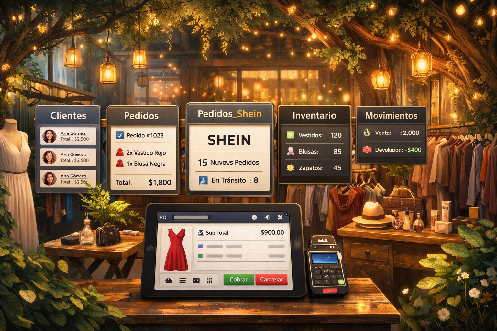

## pos-boutique

Sistema de gestión POS para tienda de ropa con modelo de crédito local.
Digitaliza y consistencia un proceso operativo existente: registro de clientes,
pedidos, movimientos de caja y control de saldo.

---

## Tabla de contenidos

- [Contexto](#contexto)
- [Stack](#stack)
- [Arquitectura](#arquitectura)
- [Estructura del proyecto](#estructura-del-proyecto)
- [Instalación y ejecución](#instalación-y-ejecución)
- [Módulos](#módulos)
- [Modelo de datos](#modelo-de-datos)
- [Versionado](#versionado)
- [Contribución](#contribución)

---

## Contexto

Tienda de ropa en pueblo pequeño. Operación actual: lápiz y papel.
El sistema no reemplaza el proceso — lo digitaliza para eliminar inconsistencias
y dejar trazabilidad de cada operación.

Modelo de negocio: crédito local. El registro de clientes, referencias y saldo
es el núcleo del sistema.

---

## Stack

| Capa           | Tecnología         | Justificación                                              |
|----------------|--------------------|------------------------------------------------------------|
| Frontend       | React + Vite       | Ligero, rápido, ampliamente documentado                    |
| Backend        | FastAPI (Python)   | Simple, moderno, genera docs de API automáticamente        |
| Base de datos  | SQLite             | Sin servidor, archivo único, respaldable con copiar/pegar  |
| Despliegue     | Local (PC tienda)  | Sin dependencia de internet ni infraestructura externa     |
| Actualizaciones| Git + GitHub       | Push desde desarrollo, pull en producción                  |

---

## Arquitectura

```
pos-boutique/
├── frontend/        # React + Vite — interfaz de usuario
├── backend/         # FastAPI — lógica de negocio y API REST
├── docs/            # Documentación técnica y de negocio
└── scripts/         # Scripts de instalación y arranque
```

El frontend consume la API REST del backend vía HTTP local.
El backend lee y escribe en un archivo SQLite único (`pos.db`).
Ambos corren en la misma máquina (PC de la ejecutiva).

```
Navegador (frontend) ──HTTP──▶ FastAPI (backend) ──▶ SQLite (pos.db)
```

---

## Estructura del proyecto

```
pos-boutique/
│
├── frontend/
│   └── src/
│       ├── components/
│       │   ├── ui/          # Botones, inputs, badges — elementos base
│       │   ├── forms/       # Formularios: cliente, pedido, operación
│       │   ├── modals/      # Ventanas emergentes: apartado, confirmaciones
│       │   └── layout/      # Header, sidebar, contenedor principal
│       ├── pages/           # Vistas: Panel Principal, Consulta, Piso de Venta
│       ├── hooks/           # Custom hooks: useCliente, useOperacion, etc.
│       ├── services/        # Llamadas a la API (fetch/axios)
│       ├── store/           # Estado global (si aplica: Zustand o Context)
│       └── utils/           # Helpers: formato de moneda, fechas, validaciones
│
├── backend/
│   └── app/
│       ├── api/
│       │   └── v1/
│       │       └── endpoints/   # Rutas: clientes, pedidos, movimientos, etc.
│       ├── core/                # Configuración, variables de entorno
│       ├── db/                  # Conexión SQLite, inicialización de tablas
│       ├── models/              # Modelos ORM (SQLAlchemy)
│       ├── schemas/             # Esquemas de validación (Pydantic)
│       └── services/            # Lógica de negocio desacoplada de las rutas
│
├── backend/tests/               # Pruebas unitarias e integración
├── docs/                        # Documentación técnica y decisiones de diseño
└── scripts/                     # install.sh, start.sh, backup.sh
```

---

## Instalación y ejecución

### Requisitos

- Python 3.11+
- Node.js 20+
- Git

### Backend

```bash
cd backend
python -m venv venv
source venv/bin/activate        # Windows: venv\Scripts\activate
pip install -r requirements.txt
uvicorn app.main:app --reload --port 8000
```

API disponible en: `http://localhost:8000`
Documentación automática: `http://localhost:8000/docs`

### Frontend

```bash
cd frontend
npm install
npm run dev
```

Interfaz disponible en: `http://localhost:5173`

---

## Módulos

| Módulo            | Descripción                                              | Tabla principal   |
|-------------------|----------------------------------------------------------|-------------------|
| Agregar Cliente   | Registro de nuevo cliente con referencia                 | Clientes          |
| Pedido            | Pedido de catálogo formal o informal                     | Pedidos           |
| Shein             | Pedido especial vía app Shein; cuenta separada           | Pedidos_Shein     |
| Piso de Venta     | Venta de producto físico en stock                        | Inventario        |
| Consulta          | Historial de compras, pagos y saldo por cliente          | Movimientos       |
| Panel Principal   | Registro de operaciones de caja (Contado, Apartado, etc.)| Movimientos       |

### Operaciones del Panel Principal

| Operación | Cliente     | Producto | Genera saldo |
|-----------|-------------|----------|--------------|
| Contado   | Opcional    | Sí       | No           |
| Apartado  | Obligatorio | Sí       | Sí           |
| Abono     | Obligatorio | No       | Sí           |
| Gasto     | No          | No       | No           |

---

## Modelo de datos

```
Clientes
  id_cliente (PK)
  nombre, colonia, telefono, referencia, no_cliente

Pedidos
  id_pedido (PK)
  id_cliente (FK → Clientes)
  producto, marca, talla, opcion, fecha

Pedidos_Shein
  id_pedido_shein (PK)
  id_cliente (FK → Clientes)
  producto, monto, fecha, bono_aplicado

Inventario
  id_producto (PK)
  descripcion, talla, cantidad, precio

Movimientos
  id_movimiento (PK)
  operacion          -- Contado | Apartado | Abono | Gasto
  id_cliente (FK → Clientes, nullable)
  id_producto (FK → Inventario, nullable)
  monto, forma_pago, saldo_resultante, fecha
```

Toda operación genera un registro en `Movimientos`.
Las relaciones con `Clientes` e `Inventario` son opcionales según el contexto.

---

## Versionado

| Versión | Alcance                                                        | Estado     |
|---------|----------------------------------------------------------------|------------|
| v0.1    | MVP: clientes, panel de operaciones, consulta                  | En curso   |
| v0.2    | Piso de Venta + integración inventario (spreadsheet → DB)      | Pendiente  |
| v0.3    | Devoluciones, préstamos de exhibición, operaciones especiales  | Pendiente  |
| v1.0    | Sistema estable, probado en operación real                     | Pendiente  |

El versionado sigue [Semantic Versioning](https://semver.org/lang/es/).
Cada versión se ramifica desde `main` como `release/vX.X`.

---

## Contribución

```bash
# Clonar el repositorio
git clone https://github.com/<org>/pos-boutique.git
cd pos-boutique

# Crear rama de trabajo
git checkout -b feature/nombre-de-la-funcionalidad

# Al terminar
git push origin feature/nombre-de-la-funcionalidad
# Abrir Pull Request hacia main
```

Convenciones de commits:

```
feat:     nueva funcionalidad
fix:      corrección de bug
docs:     cambios en documentación
refactor: reestructura sin cambio de comportamiento
chore:    tareas de mantenimiento (deps, config)
``` pos-boutique
UI/UX escalable para punto de venta

## Estado actual

- [x] Repositorio creado
- [x] Estructura de carpetas
- [ ] venv backend
- [ ] Dependencias backend (requirements.txt)
- [ ] Dependencias frontend (package.json)
- [ ] Base de datos: esquema inicial
